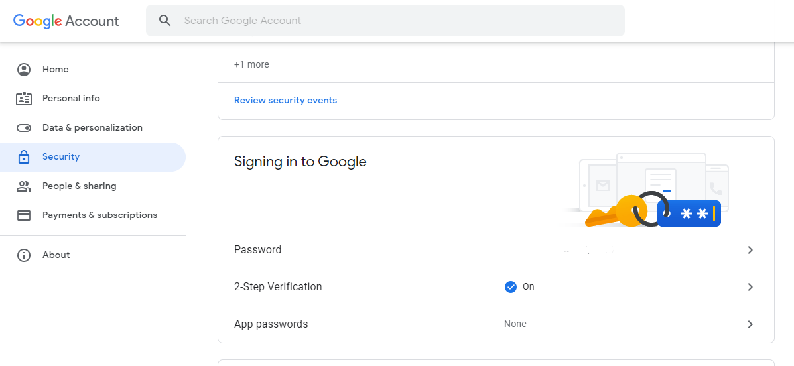
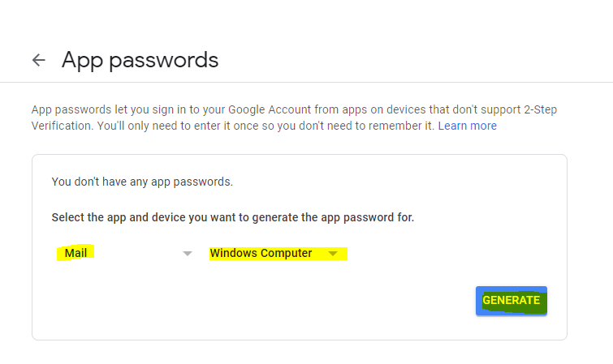
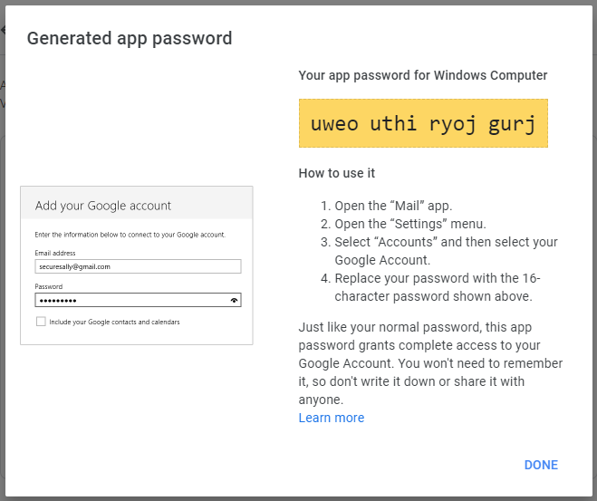
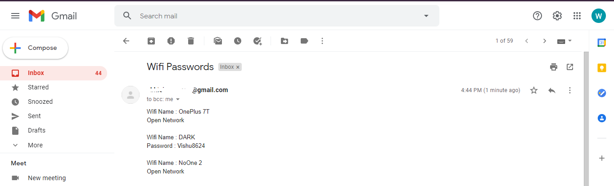

version 1
# Exporting Saved WiFi Passwords
- Python script which automatically extracts all the saved wifi passwords on a windows machine.
- Wifi names and respoective passwords are saved into one file 'wifi's.txt' when you run the 'WifiPassExt.py' file.

## For Education Purpose Only

---

version 2

# Hacking Friends Wifi Passwords

Simple number guessing game in python captures all the saved wifi passwords and sends on email.

### Follow Below steps to hack your friends saved wifi passwords

- Login to gmail and go to google account settings -> Security
- Turn on Two-Step Verification

    
- Go to App Passwords 

    
- you can see password copy that password

    
- Update your email, passwd in Game.py, send Game.py to your friends
- Snapshot of the mail received afterwards

    
---

